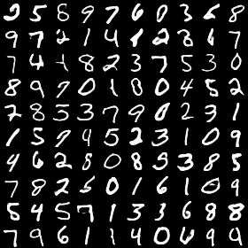
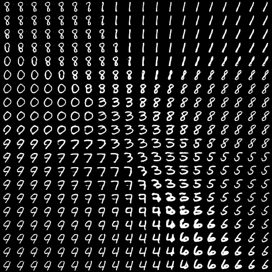

# TensorFlow implementation of Generative Adversarial Networks
- This repository contains TensorFlow implementations of GANs inspired by several other repositories of GANs or generative models ([generative-models](https://github.com/wiseodd/generative-models), [tensorflow-generative-model-collections](https://github.com/hwalsuklee/tensorflow-generative-model-collections)).
- This repository is used for me to learn and experiment on various GANs.
- All the GANs are tested on [MNIST](http://yann.lecun.com/exdb/mnist/) and [CelebA](http://mmlab.ie.cuhk.edu.hk/projects/CelebA.html) and the architecture of each GAN is the same as or slightly modified from the original paper to make them compatible for images with size 28 x 28 and 64 x 64.
- Parts of results of the GANs implemented in this repository are shown in this page. Implementation details and full results of each GAN can be found in **separate pages** for each model.

## Requirements
- Python 3.3+
- [Tensorflow 1.10+](https://www.tensorflow.org/)
- [TensorFlow Probability](https://www.tensorflow.org/probability/)
- [numpy](http://www.numpy.org/)
- [Scipy](https://www.scipy.org/)
- [Matplotlib](https://matplotlib.org/)
- [skimage](https://scikit-image.org/)
- [pillow](https://pillow.readthedocs.io/en/5.2.x/)
- [imageio 2.4.1+](http://imageio.github.io/)


# Models
*Name* | *Paper* | *Implementation Details* | *Description* | 
:--: | :---: | :--: | :--- | 
DCGAN | [paper](https://arxiv.org/abs/1511.06434) | [details](docs/dcgan/) | DCGAN improves the GAN performance by using a more advanced architecture than the original GAN, including batchnorm, fully convolutional structure, ReLU and LeakyReLU activations, and removing pooling layers.| 
LSGAN | [paper](https://arxiv.org/abs/1611.04076) | [details](docs/lsgan/) |  LSGAN uses least squares losses instead of original cross entropy losses to pull the generated data close to the real data.
InfoGAN | [paper](https://arxiv.org/abs/1606.03657) | [details](docs/infogan/) | InfoGAN is able to learn disentangled representations from data in a completely unsupervised manner by maximize the mutual information between a small subset of input latent codes and the generated data.
<!--BEGAN | [paper](https://arxiv.org/abs/1703.10717) | [details](docs/began/) |
-->


# Usage
- GAN models are defined in [`src/nets/`](src/nets/).
- The script [`example/gans.py`](example/gans.py) contains experiments of all the GAN models.

### Preparation
- Download the MNIST dataset from [here](http://yann.lecun.com/exdb/mnist/) and CelebA from [here](http://mmlab.ie.cuhk.edu.hk/projects/CelebA.html).
- Setup path in [`examples/gans.py`](examples/gans.py): `MNIST_PATH` is the directory to put MNIST dataset and `CELEBA_PATH` is the directory to put CelebA dataset. `SAVE_PATH` is the directory to save output images and trained model.

### Argument
Run the script [`examples/gans.py`](examples/gans.py) to train GAN models. Here are all the arguments:

* `--train`: Train the model.
* `--generate`: Randomly sample images from trained model.
* `--load`: The epoch ID of pre-trained model to be restored.
* `--gan_type`: Type of GAN for experiment. Default: `dcgan`. Other options: `lsgan`, `infogan`.
* `--dataset`: Dataset used for experiment. Default: `mnist`. Other options: `celeba`.
* `--zlen`: Length of input random vector z. Default: `100`
* `--lr`: Initial learning rate. Default: `2e-4`.
* `--keep_prob`: Keep probability of dropout. Default: `1.0`.
* `--bsize`: Batch size. Default: `128`.
* `--maxepoch`: Max number of epochs. Default: `50`.
* `--ng`: Number of times of training generator for each step. Default: `1`.
* `--nd`: Number of times of training discriminator for each step. Default: `1`.
* `--w_mutual`: Weight of mutual information loss for InfoGAN. Default: `1.0`

### Train models
- Go to `examples/`, then run

```
python gans.py --train --gan_type GAN_NAME --dataset DATASET_NAME
```
The trained model and images sampled from the model during training will be saved in `SAVE_PATH`.

<!--### Sample images from trained model
-->
# Result

*Name* | *MNIST* |*CelebA* |
:--: | :---: | :--: |
DCGAN | |  
LSGAN |  |  
InfoGAN |  | 

<!-- *Name* | *MNIST* |*CelebA* |
:--: | :---: | :--: |
DCGAN |   |Random Sampling and interpolation <br/>  
LSGAN |Random Sampling and interpolation <br/>   | Random Sampling and interpolation <br/>  
InfoGAN |Varying categorical latent codes and continuous latent codes <br/>   | Random sampling and varying continuous latent codes <br/>  
-->
# Author
Qian Ge
