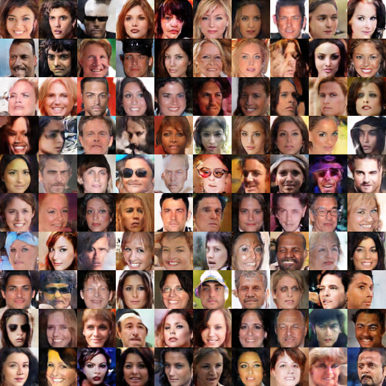
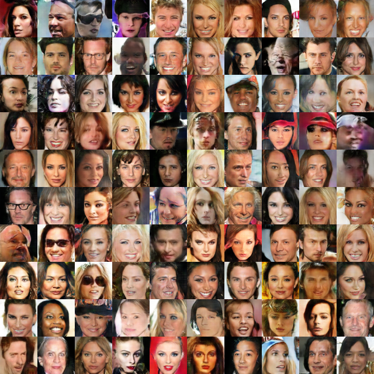
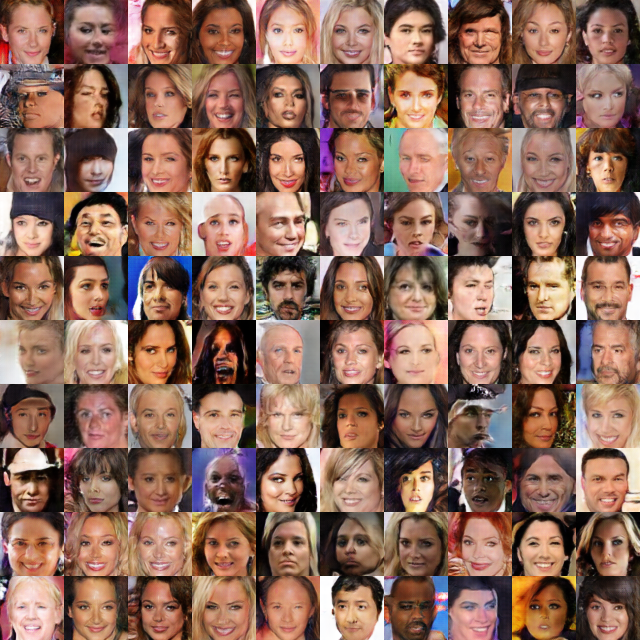
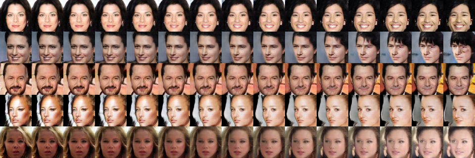
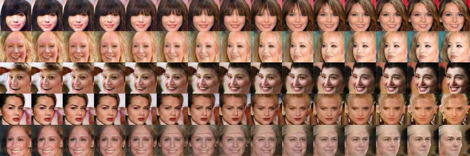

# Deep Convolutional Generative Adversarial Networks (DCGAN)

- TensorFlow implementation of [Unsupervised Representation Learning with Deep Convolutional Generative Adversarial Networks](https://arxiv.org/abs/1511.06434) (ICLR 2016). 
- Both generator and discriminator are multiple layers CNNs. Generator takes a random vector as input. Discriminator takes real and fake images as input. Feature maps are up-sampled and down-sampled through convolutional layers with stride = 2, so there is no pooling layers.
 
## Requirements
- Python 3.3+
- [Tensorflow 1.9+](https://www.tensorflow.org/)
- [numpy](http://www.numpy.org/)
- [Scipy](https://www.scipy.org/)
- [Matplotlib](https://matplotlib.org/)

## Implementation Details
- DCGAN model is defined in [`/src/nets/dcgan.py`](/src/nets/dcgan.py). An example to show how to train and test the model is defined in [`examples/gans.py`](../../examples/gans.py).
- As mentioned in the paper, [batch normalization](https://arxiv.org/abs/1502.03167) is used for all layers of generator and discriminator except the first and output layer of discriminator and the last layer of generator.
- ReLU is used in the generator except for the output, which uses Tanh. LeakyReLU with Leaky = 0.2 is used in the discriminators.
- All weights are initialized from a zero-centered Normal distribution with standard deviation 0.02. Learning rate is set to be 2e-4 and Adam optimizer with momentum = 0.5 is used for optimization.
- When applied on MNIST, Dropout with 0.5 is used both for training and testing phase after each convolutional layer of the generator except the output layer. Because I found this reduced the noise on the generated images.

## Usage 
- see here

## Results

### CelebA
vector length = 100, images are rescale to 64 x 64

*Epoch 1* | *Epoch 10* |*Epoch 20* | *Epoch 25* |
:--: | :---: | :--: | :---: | 
 | | | 

- More result at epoch 25

- Interpolation between two faces

