# InfoGAN

- TensorFlow implementation of [- InfoGAN: Interpretable Representation Learning by Information Maximizing Generative Adversarial Nets](https://arxiv.org/abs/1511.06434) (ICLR 2016). 
- InfoGAN is able to learn disentangled representation in an unsupervised manner based on information theory.
- Input vector of generator consists of random vectors as well as several latent codes, which can be used to capture the hidden representations of data by maximizing the mutual information between the latent variables and the generated samples.
- The mutual information is maximizing through the [variational information maximization](https://pdfs.semanticscholar.org/f586/4b47b1d848e4426319a8bb28efeeaf55a52a.pdf), which finds a lower bound of the mutual information by defining an auxiliary distribution Q(c|x), where c is the latent code and x is the observation (samples).
- The auxiliary distribution Q(c|x) is parameterized by a neural network sharing parameters with convolutional layers of the discriminator.
 

## Implementation Details
- InfoGAN model is defined in [`/src/nets/infogan.py`](/src/nets/infogan.py). An example to show how to train and test the model is defined in [`examples/gans.py`](../../examples/gans.py).
- Random input vector and continuous input hidden codes are uniformly sampled within [-1, 1]. Discrete input latent codes are sampled from categorical distributions and then convert to one-hot vectors.
- The auxiliary distribution Q(c|x) is modeled by multinomial distributions for discrete input latent codes and by Gaussian distributions continuous input hidden codes.
- The discriminator is the same as the discriminator used in [DCGAN](https://arxiv.org/abs/1511.06434). The generator is similar to the one used in DCGAN but the last transpose convolutional layer is removed, since I found if the generator is too strong, it will tend to ignore the input random vectors and there will be not variance under the same discrete hidden code. Also an additional fully connected layer with 1024 hidden units is used for input, which provides better results visually.
- All weights are initialized from a zero-centered Normal distribution with standard deviation 0.02. Learning rate is set to be 2e-4 and 2e-3 for discriminator and generator, respectively, as suggest in the paper. Adam optimizer with beta1 = 0.5 is used for optimization both generator and discriminator.

## Usage 
- see here

## Results
### MNIST
- Random noise vector length = 100
- One 10D categorical code and four continuous latent codes are used.

The categorical code is fixed for each row. The generator generates digits `5` and `8` with the same categorical code. However, it is able to distinguish other digits well.

*Epoch 1* | *Epoch 10* |*Epoch 30* | *Epoch 50* |
:--: | :---: | :--: | :---: | 
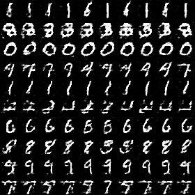 | 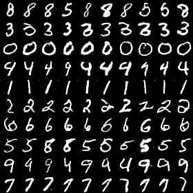|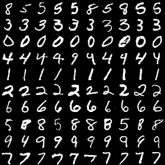 | 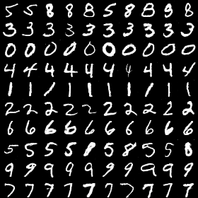

- Varying continuous latent codes from -1 to 1 after 50 epochs. All other continuous latent codes are fixed and the categorical code is fixed for each row.

*code 1 (Width)* | *code 2 (Rotation)* |*code 3 (Expanding)* | *code 4 (Enlarge)*
:--: | :---: | :--: | :--: | 
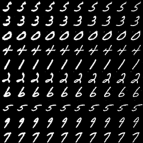 | 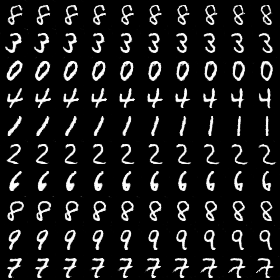|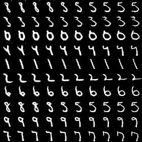|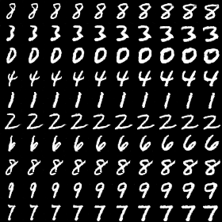|

### CelebA
- Random noise vector length = 100.
- Five continuous latent codes are used.
- Image are rescaled to 32 x 32.

*Epoch 1* | *Epoch 10* |*Epoch 25* | *Epoch 50* |
:--: | :---: | :--: | :---: | 
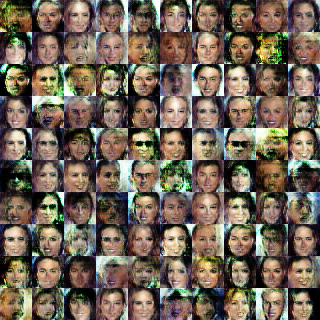 | 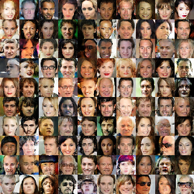|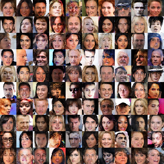 | 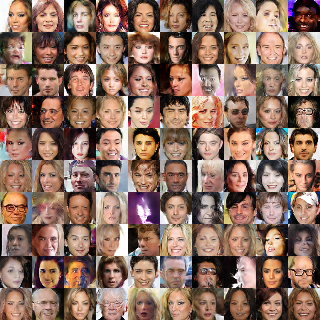

- Varying continuous latent codes from -1 to 1 after 25 epochs. One latent codes varying from -1 to 1 along each row, and keep the same for all rows. Other latent codes are randomly selected and fixed for each row. Thus, the generated faces varying with a specific latent code can be observed along the rows.
- During the training, I found one latent code may capture more than one futures. Maybe more latent codes can provide better separation.

*code 1 (Hair Color)* | *code 2 (Glasses)* |*code 3 (Female-Male)* | 
:--: | :---: | :--: | 
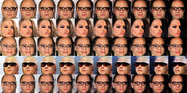 | 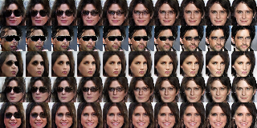|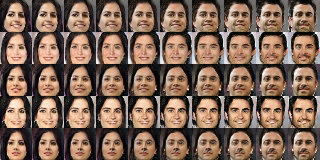|
*code 4 (Azimuth)* | *code 5 (Emotion)* |
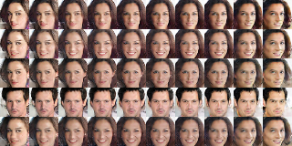 | 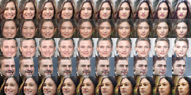|

