# Least Squares Generative Adversarial Networks (LSGAN)

- TensorFlow implementation of [Least Squares Generative Adversarial Networks](https://arxiv.org/abs/1611.04076) (ICCV 2017). 
- The LSGAN uses least square loss function to pull data generated by generator towards the real data manifold. Not like log loss which only penalizes the sample with incorrect sign, the least square loss penalizes the samples far away from the decision boundary.
- The least square loss function make the training more stable because it can provide more gradients by penalizing the samples far away from decision boundary when updataing the generator.
 
## Requirements
- Python 3.3+
- [Tensorflow 1.9+](https://www.tensorflow.org/)
- [numpy](http://www.numpy.org/)
- [Scipy](https://www.scipy.org/)
- [Matplotlib](https://matplotlib.org/)

## Implementation Details
- The architectures of discriminator and generator are exactly the same as mentioned in the paper.
- LSGAN model is defined in [`src/nets/lsgan.py`](../../src/nets/lsgan.py). An example to show how to train and test the model can be found in [`examples/gans.py`](../../examples/gans.py).
- Random input vector are uniformly sampled within [-1, 1].
- The linear activation function instead of sigmoid is used for the output of discriminator, since the least square loss with sigmoid easily gets saturated. 
- When applied on MNIST, Dropout with 0.5 is used both for training and testing phase after each convolutional layer of the generator except the output layer. Because I found this reduced the noise on the generated images.

## Usage 
- see here

## Results
### MNIST
- vector length = 100, images size 28 x 28, generator dropout = 0.5 for both training and testing. Dropout is used for the same reason as my implementation of **[DCGAN]**

- The generated images get much better after adding dropout.

*Epoch 1* | *Epoch 7* |*Epoch 14* | *Epoch 21* |
:--: | :---: | :--: | :---: | 
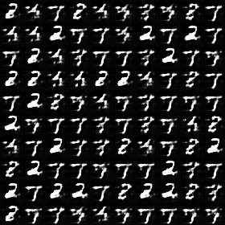 | 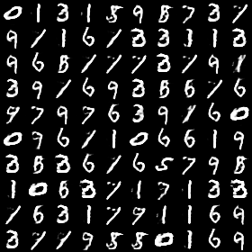|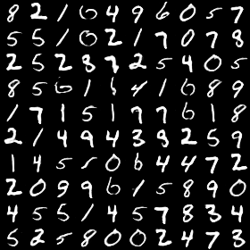 | 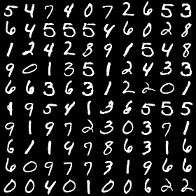

- Interpolation between two digits

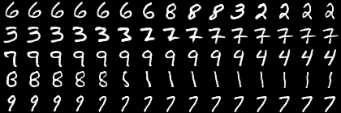

- Images generated by uniformly sampling along x = [-1, 1] and y = [-1, 1] when input vector lenght is 2. 

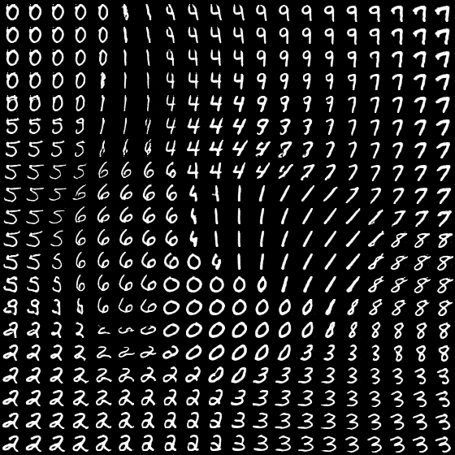

### CelebA
- vector length = 1024, images are rescale to 64 x 64, no dropout
- At beginning, the model generates better and better faces, then it breaks down at around epoch 7. However, when I continue training the model, it is finally able to generate nice faces.

*Epoch 1* | *Epoch 7* |
:--: | :---: |
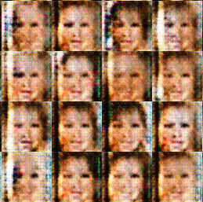 | 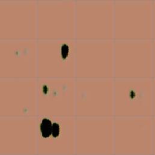|

*Epoch 17* | *Epoch 27* |*Epoch 50* |
:--: | :---: | :--: |
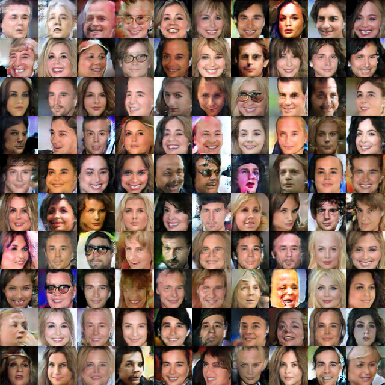 | 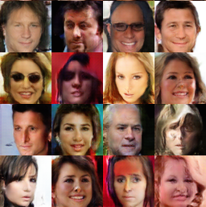|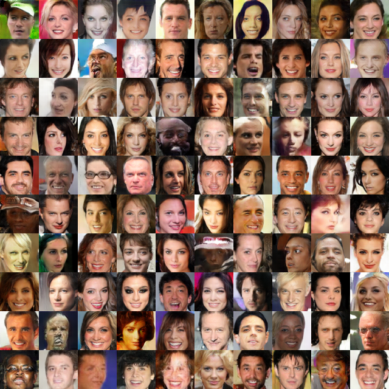

- More result at epoch 25

- Interpolation between two faces

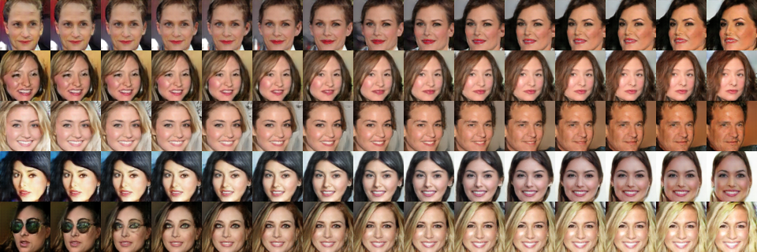
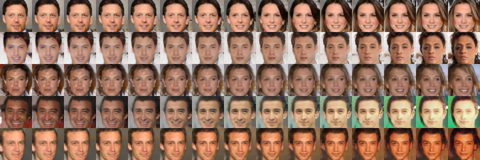

